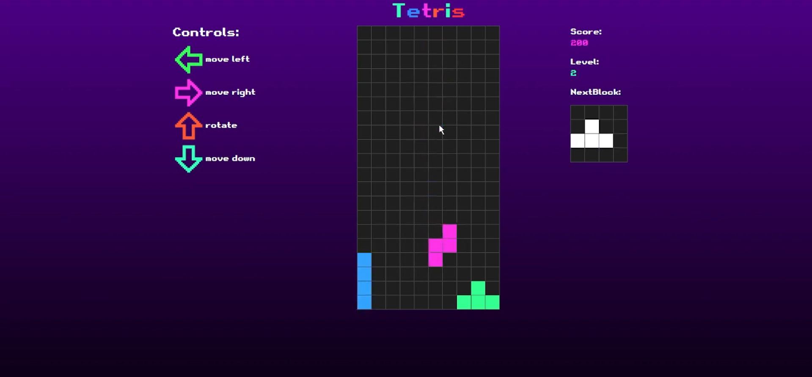
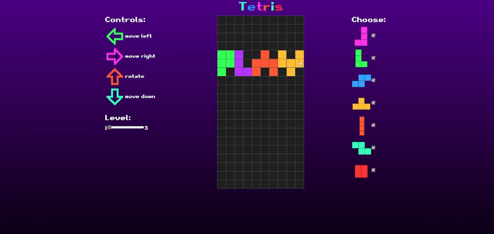
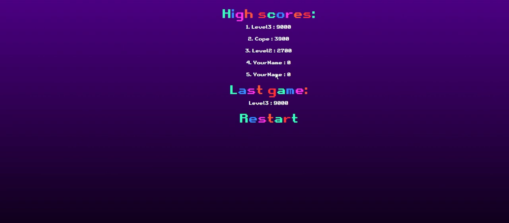

# Tetris Game

This is a classic Tetris game built using JavaScript, HTML, and CSS. The game features simple yet smooth gameplay, allowing players to stack falling blocks and clear lines in the timeless puzzle style.

## Gameplay

- **Controls**: Use the arrow keys to move, rotate, and drop the blocks.
- **Objective**: Clear as many lines as possible by fitting the falling tetrominoes together.
- **Levels**: The game speeds up progressively as the player clears more lines, increasing the challenge.

## Features

- Fully implemented in JavaScript, HTML, and CSS.
- Smooth, responsive controls for a satisfying gameplay experience.
- Progressive difficulty as the game speeds up.
- Different dificultys to start levels 1,2,3
## How to Play

1. Use the arrow keys to move the tetrominoes left, right, or down.
2. Press the rotate key (typically the up arrow) to rotate the falling tetromino.
3. Try to complete full lines to clear them and earn points.
4. The game ends when the tetrominoes stack up to the top of the screen.

## Screenshots

- 
- 
- 

## Video Showcase

Watch the gameplay showcase on [YouTube](https://youtu.be/LebTwJsNRlU).
